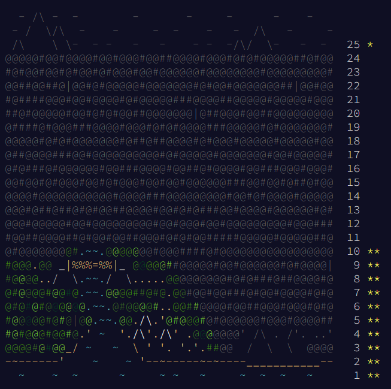

# Advent of Code 2022

My solutions to the [Advent of Code 2022](https://adventofcode.com/2022).

## Summary
Mostly in C#, both for .net framework 4.8 and .net 7.0 but some projects in C++.
Time did not allow me to compete on all the days.

* [Day 1: Calorie Counting](https://adventofcode.com/2022/day/1) :star: :star:
* [Day 2: Rock Paper Scissors](https://adventofcode.com/2022/day/2) :star: :star:
* [Day 3: Rucksack Reorganization](https://adventofcode.com/2022/day/3) :star: :star:
* [Day 4: Camp Cleanup](https://adventofcode.com/2022/day/4) :star: :star:
* [Day 5: Supply Stacks](https://adventofcode.com/2022/day/5) :star: :star:
* [Day 6: Tuning Trouble](https://adventofcode.com/2022/day/6) :star: :star:
* [Day 7: No Space Left On Device](https://adventofcode.com/2022/day/7) :star: :star:
* [Day 8: Treetop Tree House](https://adventofcode.com/2022/day/8) :star: :star:
* [Day 9: Rope Bridge](https://adventofcode.com/2022/day/9) :star: :star:
* [Day 10: Cathode-Ray Tube](https://adventofcode.com/2022/day/10) :star:
* [Day 25: Full of Hot Air](https://adventofcode.com/2022/day/25) :star:

20 :star:

## Author and License
RedFiveCode (https://github.com/RedFiveCode)

Copyright (c) © 2022 RedFiveCode (https://github.com/RedFiveCode) All rights reserved.

Released under MIT License (see License file).